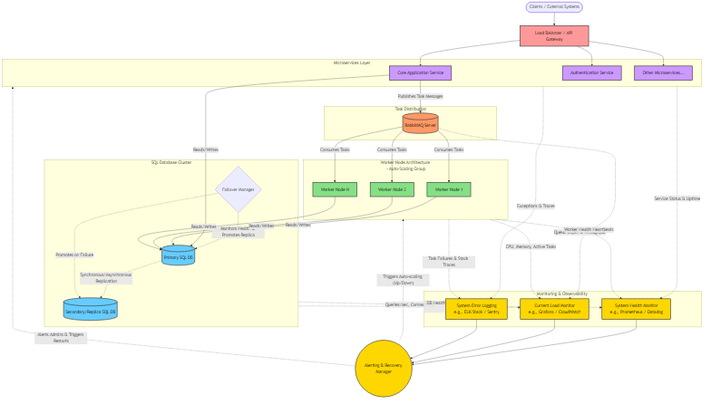

# Python Developer Assessment — Automation & Crawling

A technical assessment covering browser automation, CAPTCHA bypass, network interception, and DOM scraping using Python.

## Tasks

### Task 1 — Turnstile CAPTCHA Bypass

Automates solving Cloudflare Turnstile CAPTCHA in both **headed** and **headless** modes using Playwright with stealth techniques to avoid bot detection.

- Runs 10 attempts (7 headed + 3 headless)
- Extracts the Turnstile response token
- Records video of each attempt
- Target: ≥ 60% success rate ✅

📹 Demo: [`Task1/Video.mp4`](Task1/Video.mp4)

---

### Task 2 — Network Interception & Token Injection

Intercepts and blocks Cloudflare Turnstile requests, then injects a pre-captured token to bypass the CAPTCHA.

**How it works:**
1. **Phase 1** — Solve Turnstile normally to capture a valid token
2. **Phase 2** — Block all Turnstile requests, extract widget config (`sitekey`, `action`, etc.), inject the token, and submit

📹 Demo: [`Task2/Video.mp4`](Task2/Video.mp4)

---

### Task 3 — DOM Scraping & Image Extraction

Scrapes a CAPTCHA challenge page using Selenium to extract images and the text instruction.

**Outputs:**
- `allimages.json` — All images in the DOM (base64)
- `visible_images_only.json` — The 9 visible images (resolved by z-index)
- `instruction.txt` — The visible instruction text

---

### Task 4 — System Architecture Design

A diagram showing the architecture for a scalable CAPTCHA-solving pipeline.

<p align="center">
  
</p>

---

## Setup

```bash
# Install dependencies
pip install playwright playwright-stealth selenium webdriver-manager

# Install browsers
playwright install
```

## Run

```bash
python Task1/automation.py   # Turnstile Bypass
python Task2/automation.py   # Network Interception
python Task3/automation.py   # DOM Scraping
```

## Project Structure

```
├── Task1/
│   ├── automation.py        # Turnstile bypass script
│   └── Video.mp4            # Demo recording
├── Task2/
│   ├── automation.py        # Network interception script
│   └── Video.mp4            # Demo recording
├── Task3/
│   ├── automation.py        # DOM scraper
│   ├── allimages.json       # All extracted images
│   ├── visible_images_only.json
│   └── instruction.txt      # Scraped instruction
├── Task4/
│   └── Task4_System_Diagram.png
└── README.md
```

## Tech Stack

- **Python 3.10+**
- **Playwright** — Browser automation (Tasks 1 & 2)
- **Selenium** — DOM scraping (Task 3)
- **playwright-stealth** — Bot detection evasion
- **Microsoft Edge / Chrome** — Browser engines
